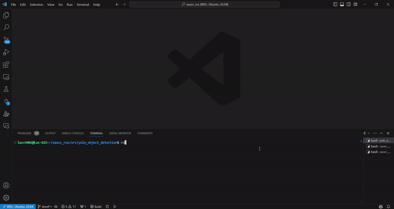

# YOLO Object Detection Package

**Table of Contents**
- [Overview](#overview)
- [Installation](#installation)
- [Usage](#usage)
- [Explanation](#explanation)
    - [Subscribed Topics](#subscribed-topics)
    - [Published Topics](#published-topics)
    - [Yolo models](#yolo-models)
- [Messages](#messages)
    - [YoloInference](#yoloinference)
    - [BoundingBox](#boundingbox)
- [Actions](#actions)
    - [OnYolo](#onyolo)

## Overview
The `yolo_object_detection` package provides tools for performing object detection using the [YOLOv8 model from ultralytics](https://docs.ultralytics.com/modes/predict/). This package is designed to work with ROS1 and facilitates the integration of YOLO-based object detection into robotic applications.

> Most importantly, you can launch *multiple instances* of the package, each with different node names and yolo_models. This allows for performing different object detection models on the same image stream. To do this, take a look at the example [launch file](./launch/yolo_inference.launch).

## Installation
To install the `yolo_object_detection` package, follow these steps:

1. Clone the repository:
    ```
    cd /path/to/catkin_ws/src
    git clone -b devel https://github.com/NTU-Mecatron/yolo_object_detection.git
    ```

2. Navigate to the package directory:
    ```
    cd yolo_object_detection
    ```

3. Install the required dependencies:

    ```
    pip install ultralytics
    ```
> Note: for heavily optimized deployment on devices with NVIDIA GPUs, you may want to install separately [torch](https://pytorch.org/get-started/locally/) and opencv with cuda support from source, before proceeding to install `ultralytics`. For opencv, please search up the tutorial for your respective platform (windows/linux/jetson).

4. Build the package:
    ```
    catkin_make
    ```

## Usage
To use the `yolo_object_detection` package, follow these steps:

```
source devel/setup.bash
roslaunch yolo_object_detection yolo_inference.launch
```

Example of running the package in simulation:

ROS side:


Unity side:


## Explanation

All parameters such as `yolo_model_name` `input_image_topic`, `inference_topic`, `annotated_frame_topic` can be modified from the [launch file](./launch/yolo_inference.launch). 

> Newest change: You will also notice that there's parameter called `default` which is set to `true`. This is because a new action server is added to the YOLO class to allow for initializing all publishers and subscribers only when a client calls for it. This allows you to run multiple instances of the YOLO node and precisely control which one is on at any given time. You can set `default` to `true` to bypass this action server and initialize from the getgo, or set to `false` to initialize only when a client calls for it.

#### Subscribed Topics
- `/sensor/camera` (`sensor_msgs/Image`): The raw image topic from the camera.

#### Published Topics
- `/yolo_node_1/inference` (`yolo_object_detection/YoloInference`): The detected objects, including bounding boxes, confidence scores, and class labels.
- `yolo_node_1/annotated_frame` (`sensor_msgs/Image`): The raw image with bounding boxes drawn around detected objects.

#### Yolo models
Currently, there are two models inside [yolo_models](./yolo_models) directory:
- `sauvc_model.pt`: A yolov8s model trained on the SAUVC 2024 dataset with 7 classes (in the following order): `Blue flare`, `Blue pail`, `Gate`, `Orange flare`, `Red flare`, `Red pail`, `Yellow flare`. The published results contain class_id, but not the semantic labels.

- `red_blue_yellow.pt`: A yolov8n model trained on the SAUVC 2024 dataset with 3 classes (in the following order): `Blue`, `Red`, `Yellow`. This model was used for communicating colours with the vehicle in the SAUVC 2024 competition.

- `ball_model.pt`: A yolov8n model trained on the SAUVC 2024 dataset with 1 class: `Ball`. This model was used for detecting the ball in the SAUVC 2024 competition.

## Messages
### YoloInference
This message contains an array of detected bounding boxes.

- `header` (`std_msgs/Header`): Standard ROS message header.
- `bounding_boxes` (`BoundingBox[]`): Array of detected bounding boxes.

### BoundingBox
This message represents a single detected bounding box.

- `x` (`float32`): The x-coordinate of the bounding box center.
- `y` (`float32`): The y-coordinate of the bounding box center.
- `w` (`float32`): The width of the bounding box.
- `h` (`float32`): The height of the bounding box.
- `conf` (`float32`): The confidence score of the detection.
- `cls` (`int32`): The class label of the detected object.

## Actions
### OnYolo

This is an action type with the following fields:
- Goal: `turn_on_or_off` (`bool`). If `true`, the YOLO node will initialize all publishers, subscribers and the YOLO model. If `false`, the YOLO node will shutdown all publishers and subscribers, kill the YOLO model and shutdown the node.
- Result: `status` (`bool`). If `true`, the YOLO node has successfully initialized or shutdown. If `false`, it is likely that the YOLO node has failed to initialize.
- Feedback: empty.

For quick testing, you can use the terminal to call the action server:

```
rostopic pub /yolo_node_1/activate_yolo_action/goal yolo_object_detection/OnYoloActionGoal ...
```

You should use `tab` to autosuggest.

For scripting, you need to write a proper action client, with code to handle success, failure and not responding cases.
